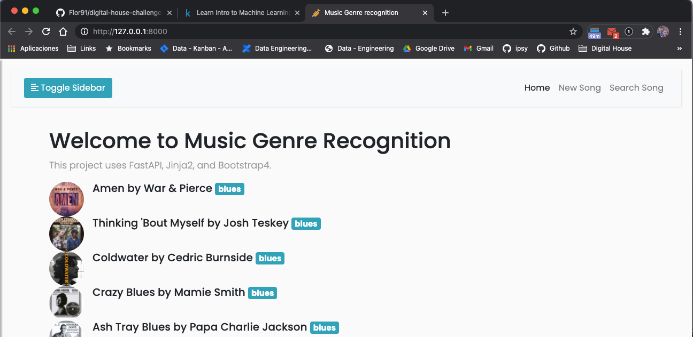
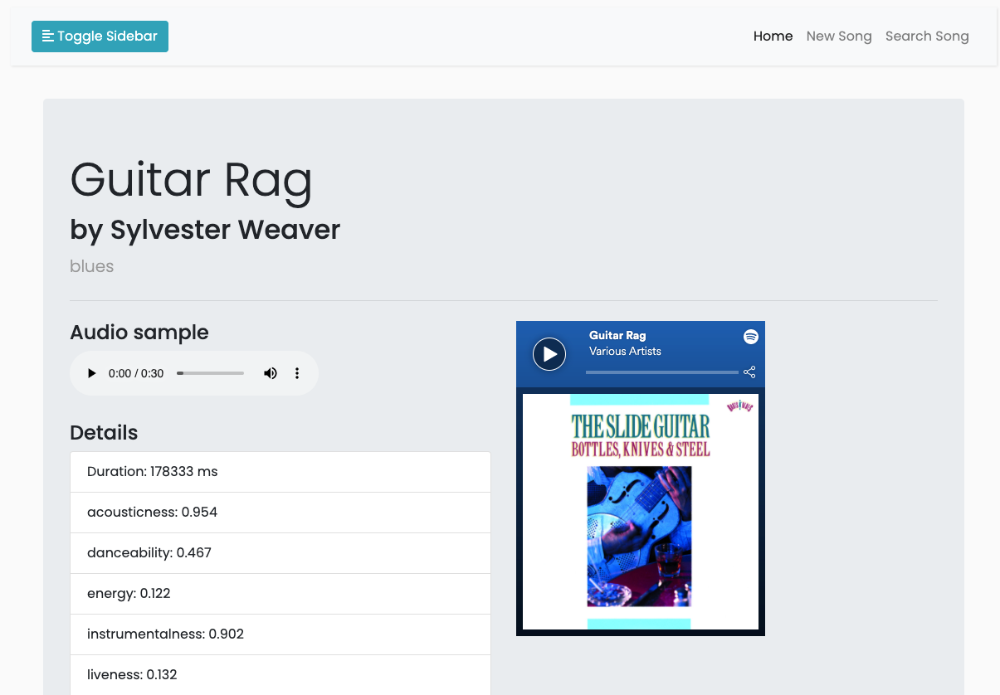

# Music Genre recognition

## About

FastAPI app that recognizes music genres based on an Spotify URI.






Technologies used:
- [FastAPI](https://fastapi.tiangolo.com/): modern, fast (high-performance), web framework for building APIs with Python 3.6+ based on standard Python type hints.
- [OpenAPI](https://github.com/OAI/OpenAPI-Specification): (ex. Swagger) The OpenAPI Specification (OAS) defines a standard, programming language-agnostic interface description for HTTP APIs, which allows both humans and computers to discover and understand the capabilities of a service without requiring access to source code, additional documentation, or inspection of network traffic. 
- [Starlette](https://www.starlette.io/): Starlette is a lightweight ASGI framework/toolkit, which is ideal for building high performance asyncio services.
- [Pydantic](https://pydantic-docs.helpmanual.io/): Data validation and settings management using python type annotations.
- [SQLAlchemy](https://www.sqlalchemy.org/): SQLAlchemy is the Python SQL toolkit and Object Relational Mapper that gives application developers the full power and flexibility of SQL.
- [Jinja2](https://jinja.palletsprojects.com/en/2.11.x/): modern and designer-friendly templating language for Python, modelled after Django’s templates. 
- [Boostrap](https://getbootstrap.com/docs/5.0/getting-started/introduction/): world’s most popular front-end open source toolkit, featuring Sass variables and mixins, responsive grid system, extensive prebuilt components, and powerful JavaScript plugins.

For data processing:
- [Librosa](https://librosa.org/): Audio and music processing with Python
- [Spotipy](https://spotipy.readthedocs.io/en/2.16.1/): lightweight Python library for the [Spotify Web API](https://developer.spotify.com/documentation/web-api/). 
- [pydub](https://github.com/jiaaro/pydub):  Manipulate audio with a simple and easy high level interface

## Run
Install dependencies with:

```commandline
pip install -r requirements.txt
```

```commandline
docker build -t genre-recognition . && docker run -d -p 8080:80 genre-recognition
```

### Development
Start app with:

```commandline
uvicorn main:app --reload
```

(Ctrl+C to quit)

App will start at:

http://127.0.0.1:8000

Swagger:

http://127.0.0.1:8000/docs

ReDoc:

http://127.0.0.1:8000/redoc
